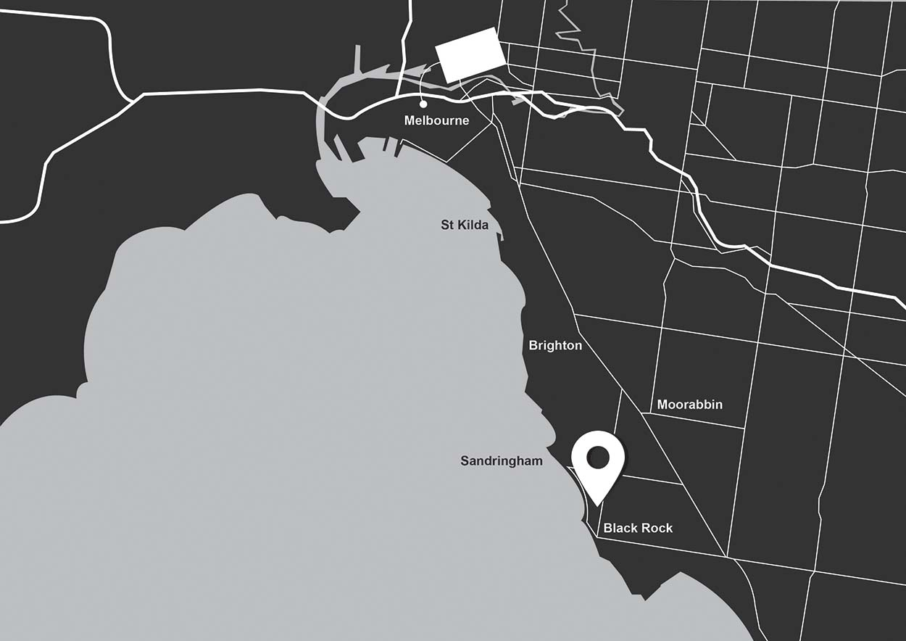

# Analytics Driven Inventory Management  - Case Study of Bluff Kup Restaurant
#### _Nattapad Salasawadi - nattapads@gmail.com_
***
### 1. Introduction

Bluff Kup Cafe & Thai Kitchen is an existing business in Melbourne. Although the business’ revenue keeps increasing every year, the ineffectiveness of the inventory causes a large amount of the inventory cost. Additionally, due to a competition within the area, the business is required to retain a number of regular customers and also attract new patrons. To enhance the business performance, business analytics will be applied to utilise historical data collected by the point-of-sale (POS) system. The report aims to demonstrate how to apply business analytics to the actual business environment, a case study of Bluff Kup Cafe and Thai Kitchen, and propose recommendations, particularly in inventory management, for the business to enhance its operations.

***
### 2. Company Overview

Bluff Kup Cafe & Thai Kitchen is a small local business located in Black Rock, Melbourne **(Figure 1)**.
The main objective of the restaurant is to provide customers with Thai authentic food and good
customer service. The restaurant is far away from the city of Melbourne around thirty minutes, so most of the patrons are local and regular. Additionally, there are other Thai cruise providers which are considered as major competitors in the area and neighbouring suburbs. Because of the competition, the restaurant is required to offer meals at economical prices in order to be more competitive.

In the hospitality industry, inventory management has played an important role in driving revenue. In order to provide a variety of foods to customers, the restaurant is required to carry a high-level of inventory (Jung & Yoon 2012). Additionally, most of the food ingredients are perishable items which can out of the shelf life before being fully used. Finally, new products might not be successfully introduced to customers. This causes losses in investments and food waste. Because the inventory management is significantly related to the restaurant’s income, issues regarding this area are selected for investigating.

##### **Figure 1** Location of Bluff Kup Cafe & Thai Kitchen in Melbourne


***
### 3. Identified Problems
#### 3.1 Identified Problems
The inventory review policy adopted by the restaurant is a periodic review policy. It seems to be convenient to employees because they are not required to frequently monitor the inventory. In some cases, however, particular ingredients are stock-out and customer needs are not satisfied. As workers are allowed to determine a quantity of replenishment based on their own assumptions, additionally, the restaurant’s inventory policy seems to be subjective and biased. To improve this problem, the business may adopt an objective and qualitative inventory policy (Wisner et al. 2016).

#### 3.2 Food Waste
Another considerable issue is food waste. Since the restaurant is unable to anticipate demands, excess inventory is more likely to occur. In the food industry, managers and kitchen workers are required to be concerned about hygiene and safety (Glanz et al. 2007). Therefore, major ingredients occasionally need to be discarded before they being efficiently used because of they perishing. By adopting predictive models and statistical methods, the business is enabled to cope with uncertainty in demand (Stefanovic 2014).

```{r COV}
RevCon <- function(directory) {
        
        # Import and merge file.csv from directory
        files_list <- list.files(directory, full.names=TRUE)
        no_of_files <- length(files_list)
        Data.df <- data.frame()
        for(h in 1:no_of_files) {
                Data.df <- rbind(Data.df, read.csv(files_list[h]))
        }
        
        # Change create_date to date format
        Data.df[,2] <- as.Date(Data.df$create_date,format='%d/%m/%Y')
        
        # Aggregate sales by invntories
        Contri.df <- aggregate(price ~ main_ingredient, Data.df, sum)
        
        # Calculate contribution in percentage
        RevCon.df <- data.frame(Contri.df,
                                round(100*(Contri.df$price/
                                        sum(Contri.df$price)),digits = 3))
        colnames(RevCon.df)[1:3] <- c("Inventory","Total_Sales","Contribution")
        
        # Sort contribution and calculate cumulative
        RevCon.df <- RevCon.df[with(RevCon.df, order(-Contribution)), ]
        RevCon.df <- data.frame(RevCon.df, cumsum(RevCon.df[,3]))
        colnames(RevCon.df)[4] <- "Cumulative"
        
        # Print results
        RevCon.df
}
```

***
As a result of the created function, contribution of individual ingredients can be calculated by inputting a name of the directory containing .csv file. The results is presented in the following table **(Table 1)**.

##### **Table 1** Contribution of ingredient to the total revenue
Inventory | Total_Sales | Contribution (%) | Cumulative (%)
------------- | :-------------: | :-------------: | -----:
Chicken  |  193099.0   |   19.311  |  19.311
Prawn  |  143169.0   |   14.318   |  33.629
Beef  |  100472.0    |   10.048   |  43.677
Pork Belly   |  39608.0    |    3.961   |  47.638
Duck  |   37433.0    |    3.744   |  51.382
Beer  |   37274.5     |   3.728  |   55.110
White Wine   |  35571.0    |    3.557   |  58.667
Jasmine Rice  |   34590.0     |   3.459   |  62.126
Corkage   |  32982.0     |   3.298    | 65.424
Barramundi   |  31951.0    |    3.195  |   68.619
Mix of entree   |  31048.0     |   3.105   |  71.724
Roti   |  30788.0     |   3.079   |  74.803
Calamari   |  25216.0   |     2.522  |   77.325
Red Wine  |   22682.0    |    2.268  |   79.593
Lamb   |  20118.0    |    2.012  |   81.605
Cabbage   |  19082.0    |    1.908  |   83.513
Soft Shell Crab   |  18547.0   |     1.855  |   85.368
Coconut Rice  |   15993.0   |     1.599  |   86.967
Soft Drink  |   13893.0   |     1.389   |  88.356
Potato   |  12957.0    |    1.296  |   89.652
Salmon   |  11492.0   |     1.149   |  90.801
Set Menu  |   10975.0    |    1.098  |   91.899
Coffee   |   9469.4    |    0.947  |   92.846
Vegetable    |  9295.0    |    0.930  |   93.776
Scallop    |  6979.0   |     0.698   |  94.474
Brown Rice  |    5918.0    |    0.592  |   95.066
Thai Dessert   |   5897.0   |     0.590  |   95.656
Ice cream    |  5185.0    |    0.519   |  96.175
Sparkling Wine    |  4781.0     |   0.478  |   96.653
Papaya   |   4732.0   |     0.473 |    97.126
Pork   |   3617.0    |    0.362  |   97.488
Quail  |    3546.0   |     0.355   |  97.843
Tofu   |   3462.0    |    0.346  |   98.189
Liquor  |    3188.0   |     0.319  |   98.508
Sparkling Water   |   3164.0   |     0.316  |   98.824
Satay Sauce  |    2717.0    |    0.272  |   99.096
Tea   |   2082.0    |    0.208   |  99.304
Golden bag   |   1824.0    |    0.182  |   99.486
Juice    |  1522.5   |     0.152   |  99.638
Rose Wine   |   1078.0    |    0.108  |   99.746
Champagne    |   748.0    |    0.075  |   99.821
Chocolate   |    660.0    |    0.066  |   99.887
Pumpkin Cake   |    460.0    |    0.046 |    99.933
Crispy Ruby   |    332.0     |   0.033  |   99.966
Sticky Rice   |    189.0    |    0.019  |   99.985
Cake   |    148.0    |    0.015   | 100.000